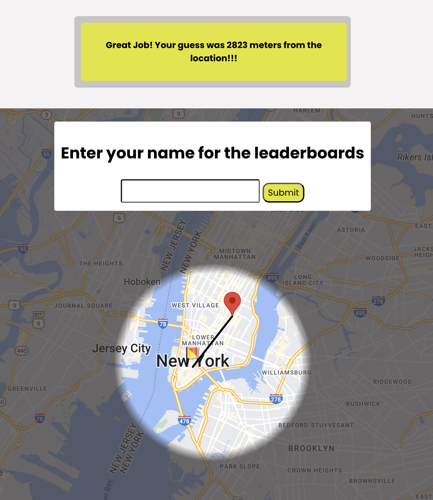

# Hide and Seek

This is a geographic guessing game (a flagrant ripoff of the popular game [geoguessr](https://www.geoguessr.com/) created by Swedish developer Anton Wallén) 

**[PLAY NOW HERE](https://hideandseekv2.netlify.app/)**

The game is meant to differentiate itself from geoguessr in the form of challenging a player to see how well they know the streets and landscape of a smaller area, as opposed to obscure locations in highways and fields often found in contemporary games.

The game presents a player with a random streetview panorama (via [Google Maps API](https://developers.google.com/maps/documentation/javascript)) - generated within a radius around lower Manhattan and a user is prompted to guess their location on a 2D map by "dropping a pin".

A player's guess is translated into points based on the distance of their guess from the Lat Lng coordinates of the streetview panorama.

Hide and Seek was originally created  with vanilla ES6 Javascript, Jquery, HTML and CSS as a school project and later rebuilt from scratch as [React](https://react.dev/) application.

Future improvements on this program would involve, primarily:

- Expanding the radius of playing to more locations
- Improving the clarity accuracy of distance calculation and conversion to points
- **Fixing the leaderboard**
 
 
----
One of my favorite parts of this game is that the vast amount of streeet views in a place as densely documented as Lower Manhattan includes lots of user uploaded panoramas. This ends up dropping the user in homes, restaurants, bookstores, boats, the inside of cars,office buildings, and even weddings.

**Some greatest hits I encountered while building and testing below:**

<iframe src="https://www.google.com/maps/embed?pb=!4v1724182017995!6m8!1m7!1sCAoSLEFGMVFpcE1wbFNndldOOWx2OXAzM2dYV180REtJSXVMWHNvVm5wU3djZGxZ!2m2!1d40.65765102834195!2d-73.99548082221943!3f177.46071202082035!4f-21.535613323935877!5f0.4000000000000002" width="600" height="450" style="border:0;" allowfullscreen="" loading="lazy" referrerpolicy="no-referrer-when-downgrade"></iframe>

<iframe src="https://www.google.com/maps/embed?pb=!4v1724182146802!6m8!1m7!1sOtqRhU0bx2xfxUBSxQyNwQ!2m2!1d40.72446192749342!2d-73.95086475623604!3f84.81284633374072!4f-29.736579515522145!5f0.44617418987170876" width="600" height="450" style="border:0;" allowfullscreen="" loading="lazy" referrerpolicy="no-referrer-when-downgrade"></iframe>

<iframe src="https://www.google.com/maps/embed?pb=!4v1724182314562!6m8!1m7!1sCAoSLEFGMVFpcFBTalRyWTN6a1ItV0NseFA4NXZueS1EbFYyNGFsS1dwdTBJdGNH!2m2!1d40.69154328243956!2d-73.95269619922237!3f105.22776646516243!4f-30.104119924062026!5f0.4000000000000002" width="600" height="450" style="border:0;" allowfullscreen="" loading="lazy" referrerpolicy="no-referrer-when-downgrade"></iframe>

<iframe src="https://www.google.com/maps/embed?pb=!4v1724182357294!6m8!1m7!1sCAoSK0FGMVFpcE5zSlhZeVVxUWlmN1dDYUdsYzU2TnJRb09ieGRBaWpUbXFyU2c.!2m2!1d40.59354609767106!2d-73.931253327962!3f282.14378497805546!4f-28.16070943712056!5f0.4000000000000002" width="600" height="450" style="border:0;" allowfullscreen="" loading="lazy" referrerpolicy="no-referrer-when-downgrade"></iframe>

<iframe src="https://www.google.com/maps/embed?pb=!4v1724182386577!6m8!1m7!1sCAoSLEFGMVFpcFBUYUVydnA4Y0ZoQ2RGRW9PQnFBVkROTEpuTmVLSVIwSERELWZZ!2m2!1d40.73848343930391!2d-73.98547994287593!3f110.81897456606762!4f-0.969033360291931!5f0.4000000000000002" width="600" height="450" style="border:0;" allowfullscreen="" loading="lazy" referrerpolicy="no-referrer-when-downgrade"></iframe>

**Im Gonna Help You Now Michael Butler (Creator of Blizzy Codes)**
<iframe src="https://www.google.com/maps/embed?pb=!4v1724183723989!6m8!1m7!1sCAoSLEFGMVFpcFBfWTJ0YVRaM1FXR3k4X0dLai1MZEpuSEVuSEZkMVJjTDY0dUFM!2m2!1d40.64511246471137!2d-73.9423904742141!3f96.10815270115421!4f-27.171377180850826!5f0.4000000000000002" width="600" height="450" style="border:0;" allowfullscreen="" loading="lazy" referrerpolicy="no-referrer-when-downgrade"></iframe>

<iframe src="https://www.google.com/maps/embed?pb=!4v1724183754292!6m8!1m7!1s9tTgk9kgf_81y7M-hsyKQQ!2m2!1d40.75948224870745!2d-73.97323515314814!3f320.3361057387814!4f-12.932083377303627!5f0.41246923431810417" width="600" height="450" style="border:0;" allowfullscreen="" loading="lazy" referrerpolicy="no-referrer-when-downgrade"></iframe>
<iframe src="https://www.google.com/maps/embed?pb=!4v1724183810442!6m8!1m7!1sMifrjLpY0HpuuvzctPCR9A!2m2!1d40.70609428496099!2d-73.99397304340519!3f295.2696976489718!4f9.90881198249059!5f0.4000000000000002" width="600" height="450" style="border:0;" allowfullscreen="" loading="lazy" referrerpolicy="no-referrer-when-downgrade"></iframe>
